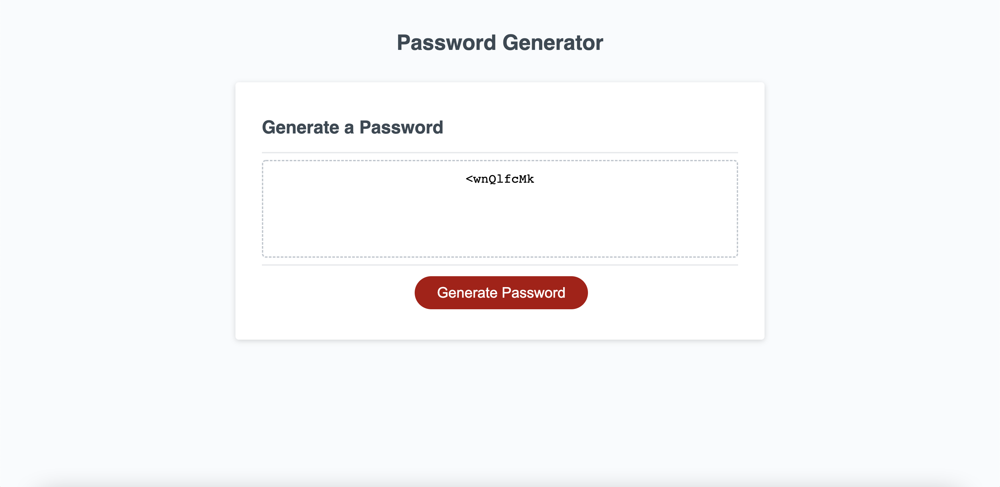

# M3-PasswordGenerator

## Website screenshot 📸

## Deployed website link 🤖

https://leilabouk.github.io/M3-PasswordGenerator/

## About this project 🐊

This project was created to meet the requirements of assignment 3. 

## Languages 💬
HTML + CSS + JavaScript

## Usage 🐗

Use this page to randomly generate a password! 
You can choose a length anywhere between 8 and 128 characters.
You can choose whether to include lowercase letters, uppercase, numbers, or special characters. 